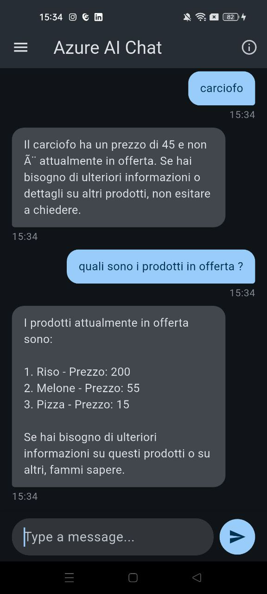

# apptesi

A new Flutter project.

## Getting Started

This project is a starting point for a Flutter application.

A few resources to get you started if this is your first Flutter project:

- [Lab: Write your first Flutter app](https://docs.flutter.dev/get-started/codelab)
- [Cookbook: Useful Flutter samples](https://docs.flutter.dev/cookbook)

For help getting started with Flutter development, view the
[online documentation](https://docs.flutter.dev/), which offers tutorials,
samples, guidance on mobile development, and a full API reference.

## 🤖 Azure AI Assistant Flutter

Un assistente intelligente sviluppato in **Flutter** che sfrutta:

- **Azure OpenAI (GPT-4)** per generare risposte contestuali
- **Azure Cognitive Search** per recuperare dati aziendali indicizzati
- **Voce di Azure (Azure Speech Service)** per leggere le risposte vocalmente
- **Account di Archiviazione Azure** come sorgente dati (es. file CSV in un container)

Il risultato è un assistente AI professionale che **risponde esclusivamente sulla base dei dati aziendali interni**, aggiornabili facilmente tramite l'archiviazione cloud.

---

## 🧠 Funzionalità principali

✅ Risposte AI basate solo sui dati aziendali forniti  
✅ Integrazione con Azure OpenAI (GPT-4, GPT-4o, ecc.)  
✅ **Contesto dinamico e aggiornabile** dai dati del container di Archiviazione Azure  
✅ Recupero dati tramite Azure Cognitive Search  
✅ Sintesi vocale naturale con **Voce di Azure (ElsaNeural)**  
✅ Gestione completa della cronologia chat in locale  
✅ Supporto configurazioni sicure via `.env`  
✅ Stato reattivo e aggiornabile via `Provider`

---

## 🏗️ Architettura

| Componente               | Descrizione                                                                 |
|--------------------------|-----------------------------------------------------------------------------|
| **Azure OpenAI**         | Elabora i messaggi e genera risposte contestuali                           |
| **Azure Cognitive Search** | Interroga i dati strutturati nel container del tuo Account di Archiviazione Azure |
| **Voce di Azure**        | Sintetizza vocalmente le risposte del modello                              |
| **ChatProvider**         | Coordina lo stato, la voce, la cronologia e i messaggi                     |
| **Storage locale**       | Salva cronologia e chat via `path_provider`    

## Esempio di utilizzo
